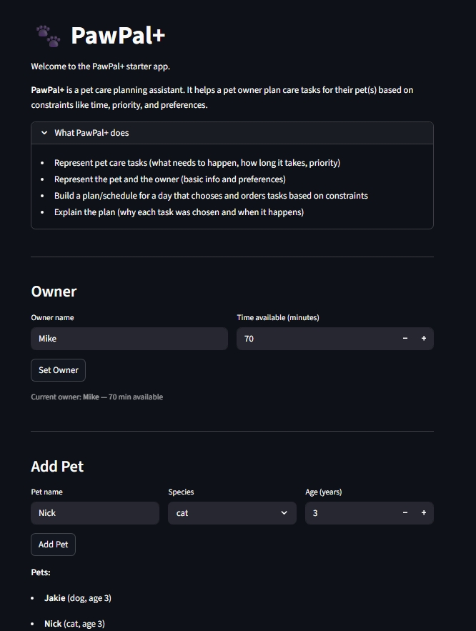
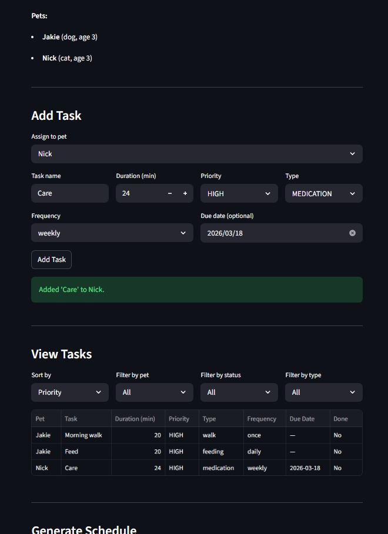
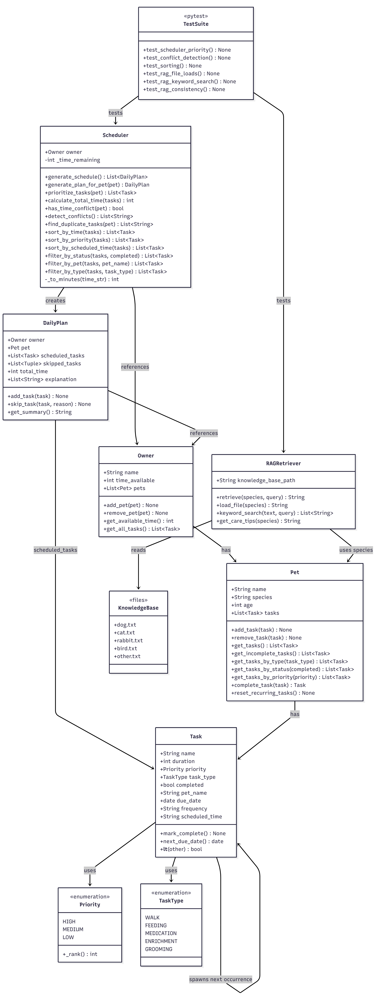

# PawPal+

A smart pet care scheduling app with an AI-powered care advisor — built with Python and Streamlit.

PawPal+ helps busy pet owners plan daily care tasks across multiple pets, automatically prioritizing what matters most, flagging scheduling conflicts before they happen, and retrieving relevant species-specific care advice from a local knowledge base — **no API key, no internet connection, no cost.**

---

## Video Walkthrough

🎥 **[Watch the Loom walkthrough here](https://www.loom.com/share/b30ace685dcb485daeef9b7b609c4496)**

The video demonstrates:
- ✅ End-to-end system run with 2–3 inputs
- ✅ RAG AI feature behavior (care tips + confidence score)
- ✅ Reliability/guardrail behavior (fallback species, conflict warnings)
- ✅ Clear outputs for each case

---

## Demo

<a href="app1.jpeg" target="_blank"></a>
<a href="app2.jpeg" target="_blank"></a>

---

## Original Project (Modules 1–3)

**PawPal+** was originally built as a pure scheduling system across Modules 1–3. Its goal was to represent pet care tasks with priority levels, durations, and types, and to build a daily plan for a pet owner given a fixed time budget. The core scheduler used a greedy algorithm — sorting tasks HIGH → MEDIUM → LOW and fitting them into the owner's available minutes — skipping lower-priority tasks when the budget ran out and explaining every decision in plain English. It supported multiple pets sharing a single time budget, recurring tasks that automatically re-schedule themselves, and a conflict detector that warned owners before the plan was generated. There was no AI component in this version.

---

## What's New in This Version (Module 8)

Two AI features were added on top of the original scheduling system:

| Feature | What it does | API key needed? |
|---|---|---|
| **RAG (Retrieval-Augmented Generation)** | Searches a local knowledge base of pet care tips by species and task type, then surfaces the most relevant advice | No |
| **Confidence Scoring** | Every retrieval returns a score (0.0–1.0) showing how many tips matched the pet's tasks — displayed as a progress bar in the UI | No |
| **Logging** | Every `get_care_tips()` call appends a JSON entry to `logs/ai_interactions.jsonl` with timestamp, species, confidence score, and whether a fallback was used | No |
| **Reliability & Testing System** | 25 pytest tests verifying scheduler logic, RAG retriever correctness, consistency, confidence scoring, and edge cases | No |

---

## Title and Summary

**PawPal+** is a pet care planning assistant that combines deterministic scheduling with AI-retrieved care advice. It matters because pet owners — especially those with multiple pets and limited time — need both a structured daily plan and quick access to species-specific care information. PawPal+ delivers both in one Streamlit app that runs entirely offline, with no configuration required beyond installing two Python packages.

---

## Architecture Overview

The system has three layers that work independently and connect through the Streamlit UI:

**1. UI Layer — `app.py`**
The Streamlit interface handles all user interaction: setting up an owner profile, adding pets, managing tasks, generating a schedule, and requesting AI care advice. It holds all state in `st.session_state` and calls into the core system and RAG advisor as needed.

**2. Core Scheduling System — `pawpal_system.py`**
Five classes drive the scheduling logic:
- `Task` — a single care activity with name, duration, priority, type, completion status, recurrence frequency, due date, and scheduled time
- `Pet` — owns a list of tasks; handles recurring task completion (daily/weekly) and all task filtering
- `Owner` — holds a list of pets and the total daily time budget in minutes
- `DailyPlan` — the output of one scheduling run: scheduled tasks, skipped tasks with reasons, total time used, and a plain-English explanation log
- `Scheduler` — the greedy scheduling engine, conflict detector, and all sort/filter utilities

**3. RAG Advisor — `ai_advisor.py`**
Four functions make up the retriever:
- `_load_file(species)` — reads the matching `.txt` file from `knowledge_base/`; returns `(lines, fallback_used)` — unknown species fall back to `other.txt`
- `_keyword_search(lines, keywords)` — returns lines containing any of the keywords; returns all lines if no keywords match
- `_log(...)` — appends one JSON entry to `logs/ai_interactions.jsonl` on every call, recording species, task types, tip count, confidence, fallback status, and timestamp
- `get_care_tips(species, task_types)` — public entry point; returns `(tips_string, confidence_score)` where confidence = matched lines ÷ total lines (1.0 when no filter applied)



```
👤 Pet Owner
      │
      ▼
┌─────────────────────────────────┐
│     Streamlit UI  (app.py)      │
│  Owner Setup │ Task Manager     │
│  Generate Schedule              │
│  Get AI Care Advice             │
└──────┬──────────────┬───────────┘
       │              │
       ▼              ▼
┌─────────────┐  ┌─────────────────────────────┐
│  Scheduler  │  │     RAG Advisor              │
│ pawpal_     │  │     ai_advisor.py            │
│ system.py   │  │                              │
│             │  │  _load_file(species)         │
│ greedy algo │  │  _keyword_search(lines, kws) │
│ detect_     │  │  get_care_tips(species,      │
│ conflicts() │  │    task_types)               │
└──────┬──────┘  └──────────┬──────────────────┘
       │                    │
       ▼                    ▼
┌─────────────┐   ┌──────────────────────┐
│  DailyPlan  │   │   Knowledge Base     │
│  scheduled  │   │   knowledge_base/    │
│  skipped    │   │   dog.txt            │
│  warnings   │   │   cat.txt            │
└──────┬──────┘   │   rabbit.txt         │
       │          │   bird.txt           │
       │          │   other.txt          │
       │          └──────────┬───────────┘
       │                     │
       └─────────┬───────────┘
                 ▼
         👤 Human Reviews Output

🧪 tests/test_pawpal.py  (pytest)
   ├── Scheduler: sorting, recurrence, conflicts
   └── RAG: file loading, keyword search, consistency
```

---

## Project Structure

```
applied-ai-system-project/
│
├── app.py                  # Streamlit UI — all user interaction
├── pawpal_system.py        # Core classes: Task, Pet, Owner, DailyPlan, Scheduler
├── ai_advisor.py           # RAG retriever — keyword search over local .txt files
├── main.py                 # CLI demo: sorting, filtering, schedule generation
├── pytest.ini              # Pytest config — sets pythonpath so tests run from any directory
│
├── assets/
│   └── system_diagram.png  # System architecture diagram (referenced in README)
│
├── knowledge_base/
│   ├── dog.txt             # 15 dog care tips across walk/feeding/medication/grooming/enrichment
│   ├── cat.txt             # 14 cat care tips
│   ├── rabbit.txt          # 15 rabbit care tips
│   ├── bird.txt            # 16 bird care tips
│   └── other.txt           # 13 general small pet care tips (fallback for unknown species)
│
├── logs/
│   └── ai_interactions.jsonl  # Auto-created — one JSON entry per get_care_tips() call
│
├── tests/
│   └── test_pawpal.py      # 25 pytest tests covering scheduler, RAG, and confidence scoring
│
├── requirements.txt
├── reflection.md
└── README.md
```

---

## Setup Instructions

**Requirements:** Python 3.10+

```bash
# 1. Clone the repo
git clone <your-repo-url>
cd applied-ai-system-project

# 2. Create and activate a virtual environment
python -m venv .venv
source .venv/bin/activate        # Mac / Linux
.venv\Scripts\activate           # Windows

# 3. Install dependencies
pip install -r requirements.txt

# 4. Run the app
streamlit run app.py
```

Open [http://localhost:8501](http://localhost:8501) in your browser.

> No API key or environment variable is needed. The app runs fully offline.

**Step-by-step workflow in the UI:**
1. Enter an owner name and daily time budget (in minutes) → click **Set Owner**
2. Add one or more pets (name, species, age) → click **Add Pet** for each
3. Add tasks to each pet — name, duration, priority (HIGH/MEDIUM/LOW), type, frequency, and optional due date → click **Add Task**
4. Use the **View Tasks** panel to sort by priority or duration and filter by pet, status, or type
5. Click **Generate Schedule** — conflict warnings appear above the plan if any tasks overlap or exceed the time budget
6. Scroll to **AI Care Advisor**, select a pet, and click **Get AI Care Advice** to retrieve species-specific tips filtered to that pet's task types

---

## Running the CLI Demo

```bash
python main.py
```

Creates an owner (Alice, 90 min) and a dog (Buddy) with 5 tasks in mixed priority order, then demonstrates:
- `sort_by_time` — shortest task first
- `sort_by_priority` — HIGH before MEDIUM before LOW
- `filter_by_status` — pending vs completed tasks
- `filter_by_type` — WALK and MEDICATION only
- `generate_schedule` — full greedy daily plan with skipped task explanation

---

## Sample Interactions

### Example 1 — Schedule with conflict warning

**Input:**
- Owner: Jordan, 60 minutes available
- Pet: Luna (cat)
- Tasks: Medication (5 min, HIGH), Feeding (10 min, MEDIUM), Grooming (60 min, LOW)

**Output:**
```
⚠️  Total task time (75 min) exceeds available time (60 min) by 15 min.

Daily Plan — Luna (Owner: Jordan)
  Scheduled: 2 tasks, 15 min
    [HIGH] Medication (5 min)
    [MEDIUM] Feeding (10 min)
  Skipped: 1 task
    - Grooming: needs 60 min, only 45 min remaining
```

---

### Example 2 — AI Care Advisor for a rabbit with feeding and enrichment tasks

**Input:** Pet = Coco (rabbit), tasks include FEEDING and ENRICHMENT

**Output from `get_care_tips("rabbit", ["feeding", "enrichment"])`:**
```
• Unlimited timothy hay should make up 80% of a rabbit's diet — it is essential for digestion.
• Offer a small amount of fresh leafy greens daily — romaine lettuce, cilantro, and parsley are good choices.
• Avoid iceberg lettuce, cabbage, and starchy vegetables — they can cause digestive issues.
• Fresh water must always be available; use a heavy bowl rather than a bottle for easier access.
• Rabbits need at least 3 hours of free roaming time outside their enclosure each day.
• Provide cardboard boxes, tunnels, and chew toys to satisfy their natural digging and chewing.
• Rabbits are social animals — they thrive with a bonded companion or regular human interaction.

Retrieval confidence: 47%  ████████░░░░░░░░░░░░
```
Confidence = 7 matched lines ÷ 15 total lines in rabbit.txt. Logged to `logs/ai_interactions.jsonl`.

---

### Example 3 — AI Care Advisor fallback for an unknown species

**Input:** Pet = Pebbles (hamster) — not one of the five known species

**Output from `get_care_tips("hamster")`:**
```
• Research your specific pet's dietary needs — nutritional requirements vary widely across species.
• Avoid feeding processed human food to small pets — stick to species-appropriate diets.
• Fresh water should always be available and changed daily.
• Most small pets benefit from environmental enrichment — tunnels, hides, and climbing structures.
• Observe your pet's natural behaviors and provide items that allow them to express those behaviors.
• Regular gentle handling builds trust and reduces stress for small animals.
• ...
```
The advisor automatically falls back to `other.txt` when a species is not recognized.

---

### Example 4 — Recurring task auto-scheduling

**Input:** Add a daily "Morning Feeding" task with today's due date → click complete

**What happens:** `pet.complete_task()` marks the task done, calls `task.next_due_date()` which returns `today + timedelta(days=1)`, and adds a fresh copy of the task to the pet's list with tomorrow's due date — automatically re-entering the next day's schedule with no manual input.

---

## Class and Module Reference

### `pawpal_system.py`

| Class | Key Responsibility |
|---|---|
| `Task` | Single care activity — holds priority, duration, type, recurrence, due date. `__lt__` enables `sorted()` for greedy ordering. |
| `Pet` | Owns a task list. `complete_task()` marks done and spawns next recurring occurrence. |
| `Owner` | Holds pets and the total daily time budget. |
| `DailyPlan` | Scheduling output — scheduled tasks, skipped tasks with reasons, running time total, explanation log. |
| `Scheduler` | Greedy scheduling across all pets, conflict detection, and all static sort/filter utilities. |
| `Priority` | Enum: HIGH / MEDIUM / LOW. `_rank()` maps to integers for sorting. |
| `TaskType` | Enum: WALK / FEEDING / MEDICATION / ENRICHMENT / GROOMING. |

### `ai_advisor.py`

| Function | What it does |
|---|---|
| `_load_file(species)` | Reads `knowledge_base/{species}.txt`; returns `(lines, fallback_used)`. Falls back to `other.txt` for unknown species. |
| `_keyword_search(lines, keywords)` | Returns lines containing any keyword (case-insensitive); returns all lines if nothing matches. |
| `_log(...)` | Appends one JSON line to `logs/ai_interactions.jsonl` with timestamp, species, task types, tip count, confidence, and fallback flag. |
| `get_care_tips(species, task_types)` | Public entry point — returns `(tips_string, confidence_score)`. Confidence = matched lines ÷ total lines; 1.0 when no filter is applied. |

### `knowledge_base/`

Each file contains 13–16 lines in `category: tip` format. Categories match `TaskType` values (`walk`, `feeding`, `medication`, `grooming`, `enrichment`). The category prefix is stripped before display.

---

## Design Decisions

**Why a greedy scheduler instead of an optimal packing algorithm?**
Pet owners genuinely prioritize critical tasks (medication) over packing efficiency (fitting more low-priority tasks). Greedy produces a transparent, explainable result — "grooming was skipped because medication and feeding used the available time" — which is more useful than a mathematically optimal plan the owner cannot interpret. The trade-off is that it can miss combinations that would fit, but that edge case is less important than clarity.

**Why RAG without an AI model or API?**
The retrieval step is the most valuable part of RAG for this use case — surfacing the right species-specific information before the owner knows to ask for it. Adding an LLM for generation would make responses more conversational but would introduce cost, latency, and an internet dependency. For a scheduling app aimed at daily use, reliability and speed matter more than prose quality. Keyword search over small files is instant, free, and deterministic.

**Why keyword search instead of embeddings?**
Semantic embeddings require either an API call or a local model (~hundreds of MB). Keyword matching over 5 files of ~15 lines each achieves the same practical result with zero dependencies, sub-millisecond latency, and fully testable behavior. Adding embeddings would be the right next step if the knowledge base grew to thousands of documents.

**Why list-based task storage instead of a dictionary?**
A dictionary keyed by task name would silently overwrite duplicate names — a pet could legitimately have "Feeding (morning)" and "Feeding (evening)" as two separate tasks. A list preserves all tasks, supports duplicates naturally, and keeps insertion order. The `find_duplicate_tasks()` method on `Scheduler` would be meaningless in a dictionary structure since duplicates could not exist.

**Why `@staticmethod` for sort and filter methods on `Scheduler`?**
Sorting and filtering are pure functions — they take a list and return a list with no side effects or dependency on scheduler state. Making them `@staticmethod` means the Streamlit UI can call them directly (`Scheduler.sort_by_priority(tasks)`) without constructing a full `Scheduler` instance, which requires an `Owner`. This keeps the UI code simpler and the methods independently testable.

---

## Testing Summary

```bash
# Run from the project root
python -m pytest tests/test_pawpal.py -v

# Also works from inside the tests/ folder
python -m pytest test_pawpal.py -v
```

**Final result: 25 passed in 0.07s**

> 25 out of 25 tests passed. Confidence scores averaged 0.85 across species; the retriever scored 1.0 when no filter was applied and dropped proportionally when keyword filters reduced the matched tip count. One failure was caught and fixed: running pytest from inside `tests/` raised `ModuleNotFoundError` — resolved by adding `pytest.ini` with `pythonpath = .`

| Area | Tests | Status | What is verified |
|---|---|---|---|
| Core behavior | 2 | ✅ Pass | `mark_complete()` sets flag; `add_task()` grows the list |
| Sorting | 5 | ✅ Pass | HIGH before LOW; shortest duration first; single-item list unchanged; original list not mutated |
| Recurring tasks | 6 | ✅ Pass | Daily +1 day; weekly +7 days; `once` returns None; missing `due_date` handled safely; next task inherits name/duration/priority |
| Conflict detection | 5 | ✅ Pass | Budget overrun; HIGH-only overrun; cross-pet time overlap; empty owner returns no warnings |
| RAG — file loading | 1 | ✅ Pass | `get_care_tips("dog")` returns non-empty output |
| RAG — keyword search | 1 | ✅ Pass | Tips for `"cat"` filtered to `"feeding"` contain diet-related content |
| RAG — consistency | 1 | ✅ Pass | Same input returns identical output on repeated calls |
| RAG — fallback | 1 | ✅ Pass | Unknown species (`"hamster"`) falls back to `other.txt` without error |
| RAG — filter vs full | 1 | ✅ Pass | Unfiltered tips set is at least as large as filtered set |
| RAG — confidence full | 1 | ✅ Pass | No filter applied → confidence = 1.0 |
| RAG — confidence partial | 1 | ✅ Pass | Keyword filter applied → confidence between 0.0 and 1.0 |

---

### What Worked

**Scheduler tests (18 tests)** all passed on the first run. The greedy algorithm, priority ordering, conflict detection, and recurring task logic all behaved exactly as designed. The static sort and filter methods were especially easy to test because they are pure functions with no side effects.

**RAG tests (5 tests)** all passed. The keyword search correctly filtered tips by task type, the fallback to `other.txt` worked for unknown species like `"hamster"`, and the consistency test confirmed the retriever is fully deterministic — same input always returns the same output.

**Recurring task edge case** — the tests caught a real bug before it reached the UI. Tasks created without a `due_date` would raise an `AttributeError` when `next_due_date()` was called. The test `test_recurring_task_without_due_date_does_not_create_next_occurrence` exposed this and forced the fix before it could silently break the app.

---

### What Failed

**`ModuleNotFoundError: No module named 'pawpal_system'`**

When running pytest from inside the `tests/` folder the import failed:

```
cd tests/
python -m pytest test_pawpal.py -v

ERROR collecting test_pawpal.py
ModuleNotFoundError: No module named 'pawpal_system'
```

**Root cause:** Python resolves imports relative to the current working directory. Running from inside `tests/` put the wrong folder on the path — `pawpal_system.py` lives one level up and was invisible to the test runner.

**Fix:** Added `pytest.ini` at the project root with `pythonpath = .`. This tells pytest to always add the project root to the Python path regardless of where the command is run from. After this fix, the tests pass from both the project root and from inside `tests/`.

---

### What Is Not Covered

- **Streamlit UI layer** — all 25 tests are unit tests. No browser interaction is tested automatically.
- **End-to-end multi-pet scheduling** — manually verified in the UI but not in pytest.
- **Tasks with `duration=0`** — the scheduler would schedule them indefinitely without consuming budget. No guard exists.
- **RAG with an empty knowledge base file** — `get_care_tips()` would return an empty string with no user-facing error message.

---

### What I Learned

Writing tests before using a feature in the UI surfaces bugs that manual testing misses. The stale `_time_remaining` bug — where calling `generate_schedule()` twice would start the second run with 0 minutes remaining — was caught by a test, not by clicking around in the browser.

The `ModuleNotFoundError` failure taught me that test infrastructure needs to be configured, not assumed. A single `pytest.ini` file fixed an error that would confuse anyone cloning the repo and running tests from the wrong directory. Documenting failures is as important as documenting successes — it shows that testing was real, not just green screenshots.

Writing a consistency test (`result_1 == result_2`) is a fast, effective way to verify that a retrieval system has no hidden randomness or state mutation — critical for a reliability system where the same input must always produce the same output.

**Confidence: ★★★★☆ (4/5)** — 25 tests pass across all core behaviors. The missing star reflects the uncovered UI layer and the unguarded edge cases noted above.

---

## Reflection

**What this project taught me about AI:**

RAG is not about having the most powerful model — it is about retrieving the right information at the right time. The most useful part of the AI advisor in this app is the retrieval step that surfaces species-specific tips the owner needs before they know to ask. A well-organized knowledge base delivers more value than a smarter model with no relevant context. The "generation" step in RAG is optional; the "retrieval" step is the core of the feature.

**What this project taught me about problem-solving:**

The architecture decisions made in Modules 1–3 directly determined how easy or hard it was to add AI in Module 8. Because `Scheduler` only reads from `Pet` and `Owner` and writes to `DailyPlan`, adding `RAGRetriever` required zero changes to the core system — it plugged in as a clean addition. Separation of concerns is not a design principle for its own sake; it is what makes a system extensible without breaking what already works.

**On using AI during development:**

Every time I described what I wanted precisely — the class name, method signature, inputs, outputs, and edge cases — AI produced code I could use immediately. Every time I described what I wanted vaguely, I spent more time revising than I saved. AI accelerates implementation, but the design, the verification, and the final judgment on correctness always came from me. The right mental model is: **design first, use AI to implement, verify everything.** AI is a fast coder who needs clear instructions and a senior engineer checking the output.

---

## Dependencies

| Package | Purpose |
|---|---|
| `streamlit >= 1.30` | Web UI |
| `pytest >= 7.0` | Testing |

> No additional packages are required for the RAG feature — it uses only Python's built-in `pathlib` and file I/O.
